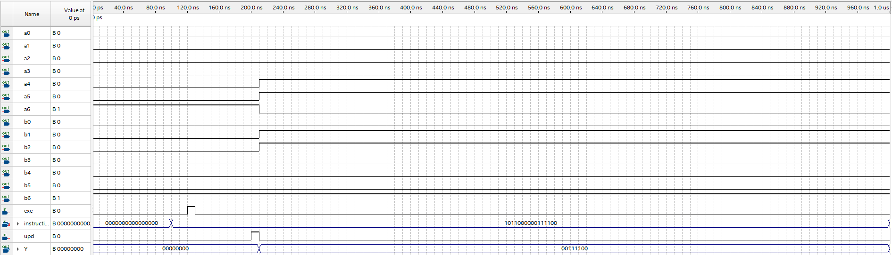

# LPD 7986 Microprocessor

An 8-bit VHDL microprocessor modeled after the x86 architecture. Designed and simulated as part of CMPS 3023 (Logic Design) at Midwestern State University, Fall 2025.

The "7986" is a stripped-down cousin of the Intel 8086, built from scratch in structural VHDL with eight distinct entities wired together into a complete datapath. It executes 10 x86-inspired instructions across four general-purpose registers, outputs results on a dual seven-segment display, and runs on a two-phase clock.



---

## Architecture

The processor follows a classic fetch-execute model with a two-phase clock:

1. **EXE** (falling edge) — latches the 16-bit instruction into the instruction register
2. **UPD** (falling edge) — writes the ALU result to the destination register

### Block Diagram

| Component | Entity | Description |
| --- | --- | --- |
| Instruction Register | `ir16` | 16-bit register, latches on EXE falling edge, extracts 6-bit opcode |
| Register File | `reg8` × 4 | Four 8-bit registers: AL, BL, CL, DL |
| Register Decoder | `dec3to4` | 3-to-4 decoder enabling the correct destination register |
| MUX A | `muxA5` | 5-input mux selecting ALU operand A (4 registers + immediate) |
| MUX B | `muxB4` | 4-input mux selecting ALU operand B (4 registers) |
| ALU | `alu8` | 8-bit ALU with 8 operations (ADD, XOR, MOV, OR, AND, SHL, SHR, NEG) |
| Display Driver | `hex7seg` × 2 | Hex-to-seven-segment decoders for high and low nibbles |
| Control Unit | (process) | Combinational logic decoding opcodes into MUX selects, ALU ops, and write enables |

### I/O Signals

- **Inputs**: 16-bit instruction bus, EXE clock, UPD clock (18 signals total)
- **Outputs**: 8-bit Y bus, 14 seven-segment display lines (22 signals total)

---

## Instruction Set

All instructions use a 16-bit encoding. Register codes: `AL = 000`, `BL = 011`, `CL = 001`, `DL = 010`.

| Mnemonic | Action | Encoding |
| --- | --- | --- |
| `ADD R1, R2` | R1 ← R1 + R2 | `0000 0000 11 reg2 reg1` |
| `XOR R1, R2` | R1 ← R1 ⊕ R2 | `0011 0000 11 reg2 reg1` |
| `MOV R1, R2` | R1 ← R2 | `1000 1000 11 reg2 reg1` |
| `MOV R, imm` | R ← immediate | `1011 0 reg immdata` |
| `OR AL, imm` | AL ← AL | imm | `0000 1100 immdata` |
| `AND AL, imm` | AL ← AL & imm | `0010 0100 immdata` |
| `SHL R, 1` | R ← R << 1 | `1101 0000 1110 0 reg` |
| `SHR R, 1` | R ← R >> 1 | `1101 0000 1110 1 reg` |
| `NEG R` | R ← two's complement of R | `1111 0110 1101 1 reg` |
| `OUT R` | Display contents of R | `1110 0110 1100 0 reg` |

---

## Project Structure

```plaintext
LPD_7986/
├── ldp7986.vhd               # Complete VHDL source (all 8 entities)
├── ldp7986.txt                # Alternate format of the VHDL source
├── Diagram.pdf                # Block diagram of the processor architecture
├── ProjectRequirements.pdf    # Original assignment specification
├── Simulation_Write_Up.md     # Simulation test vector walkthrough
└── SimulationScreenshot.PNG   # Quartus waveform output

```

---

## Simulation

Simulated in **Intel Quartus Prime** using functional simulation. The test case demonstrates a `MOV AL, 0x3C` instruction:

| Time | Event | Details |
| --- | --- | --- |
| 0 ns | Initial state | All signals at zero |
| 100 ns | Load instruction | `instruction[15..0] = 0xB03C` (`MOV AL, 0x3C`) |
| 120 ns | EXE falling edge | Instruction register latches the value |
| 200 ns | UPD falling edge | AL register loads ALU output |

**Result**: AL = `0x3C` (60 decimal). The Y bus outputs `0011 1100` and both seven-segment displays correctly render "3C".

### Verified Components

- Instruction encoding and opcode extraction
- Control unit decoding (all 10 instructions)
- Register file read/write paths
- ALU arithmetic and logic operations
- Hex display output path

---

## Tech Stack

| Tool | Purpose |
| --- | --- |
| VHDL | Hardware description language |
| Intel Quartus Prime | Synthesis and simulation |
| ModelSim / Quartus Simulator | Functional waveform verification |

---

## Course Context

**CMPS 3023 — Logic Design**  
Midwestern State University, Fall 2025

This project required designing a processor with at minimum 3 distinct VHDL entities. The final implementation uses 8 entities with a fully structural architecture, connecting all components through explicit port maps rather than behavioral shortcuts.

---

## Author

**Noah Bustard**  
Computer Science, Midwestern State University
